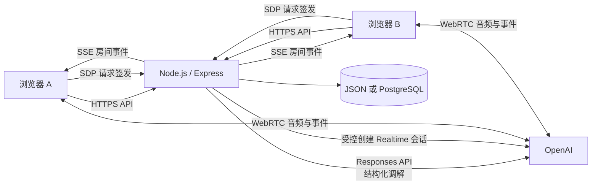

# Toward Us / 彼此：完整产品与技术介绍

> 2026-09-02 更新：产品已从单一“双人 AI 调解与复盘工具”深化为 Multi-principal Relationship Agent。新 P0 能力与权限边界以 [multi-principal-relationship-agent.zh-CN.md](./multi-principal-relationship-agent.zh-CN.md) 为准；本文继续保留原调解、demo、语音与部署说明。

> 文档定位：面向潜在用户、合作伙伴、产品设计者和工程团队，解释 Toward Us 是什么、解决什么问题、如何使用、当前已经实现什么，以及系统如何工作。
>
> 当前阶段：私人 Beta。本文以仓库当前实现为准；“未来方向”不代表已经上线。

## 1. 产品概览

### 1.1 品牌

- 英文名：**Toward Us**
- 中文名：**彼此**
- 品牌含义：冲突发生时，不继续向“谁赢谁输”移动，而是重新向“我们如何理解彼此、处理问题”移动。
- 核心表达：**在争执之外，我们选择彼此。**

### 1.2 一句话介绍

Toward Us 是一个供恋人和夫妻共同使用的双人 AI 调解与长期复盘空间：两个人可以分别用文字或语音表达自己的观点，AI 以有边界的第三方视角整理事实、感受、分歧和具体行为，给出双方都能看到的共同分析以及分别可见的私人建议，并把双方确认过的结果沉淀为共同记忆。

### 1.3 产品为什么存在

单人把争吵记录交给通用 AI，已经能够获得一份分析，但真实关系冲突通常不是单人信息整理问题。它还包含：

- 两个人都需要拥有自己的表达权，不能由一方代替另一方描述感受；
- 双方说的是同一件事，却可能持有不同事实版本；
- 情绪、需要、推测和指责经常混在一起；
- 有人需要先被理解，有人急于马上解决问题；
- 明确的不当行为需要被指出，但“判谁赢”又会继续扩大对抗；
- 私下倾诉、共同讨论和共同存档需要不同的数据边界；
- 一次争吵结束后，真正有效的修复经验很容易被忘记。

Toward Us 的产品价值不只是“AI 会分析”，而是提供一套双方都能参与、可以确认、能够追溯并受权限约束的调解程序。

## 2. 产品定位

### 2.1 第一阶段服务对象

第一版专注于恋人和夫妻，典型场景包括：

- 异地沟通：双方各自使用一台设备；
- 面对面沟通：双方共用一台手机或电脑；
- 正在争吵，希望先降低升级；
- 刚刚争吵完，希望趁记忆清楚完成复盘；
- 情绪平静，希望讨论结婚、金钱、家庭分工等长期议题；
- 希望回看过去的分歧、共识和有效修复方式。

底层使用中性的“关系空间”模型，未来可以扩展到家人、朋友或共同生活者，但当前产品文案、流程和安全边界都优先为亲密关系设计。

### 2.2 产品不是什么

Toward Us 不是：

- 宣布整场争吵谁赢谁输的辩论裁判；
- 帮助一方建立伴侣“案底”的证据工具；
- 为了形式公平而各打五十大板的和稀泥机器人；
- 心理诊断、心理治疗、医疗、法律或紧急服务的替代品；
- 在现实人身危险持续发生时继续主持责任辩论的聊天机器人；
- 只给单人使用的通用 AI 对话壳。

### 2.3 产品的长期价值

随着通用模型能力增强，单次总结和建议会越来越容易被基础模型覆盖。Toward Us 更持久的价值应当来自：

1. **可信的双人身份与授权**：谁说了什么、谁能看到什么、谁确认了什么由产品规则保证；
2. **公平的调解程序**：两个人分别表达，AI 判断行为但不宣布人格和输赢；
3. **共同记忆**：保存双方确认的事实、分歧、行动和真正有效的修复方式；
4. **隐私分层**：私人反馈、公共分析和共同历史具有不同可见范围；
5. **可验证的修复闭环**：一次分析最终落到双方是否确认、做了什么、后来是否有效。

## 3. 核心产品原则

### 3.1 解决矛盾，不争输赢

AI 可以明确指出打断、辱骂、威胁、隐瞒等具体行为的问题和责任，但不宣布“甲赢、乙输”。目标是停止升级、准确理解、明确责任并找到下一步。

### 3.2 中立不等于模糊

感受不判对错，行为可以判断，动机不能凭空推断。有明确材料时，AI 可以指出某一方在某个具体行为上承担主要责任；证据不足时必须保留不确定性。

### 3.3 评价行为，不定义人格

产品使用“这句话构成人身攻击”“刚才发生了连续打断”，而不是“你就是一个有攻击性的人”。一次冲突不能被用来诊断人格、精神疾病或依恋类型。

### 3.4 两个声音拥有同等地位

双方分别表达、分别确认、分别拥有自己的私人反馈。任何一方都不能修改另一方的表达，也不能代替另一台设备完成录音同意或共同存档确认。

### 3.5 历史是经验库，不是弹药库

历史用于寻找相似模式和有效修复方式，不用于证明“你一直都这样”。系统不会在激烈冲突中自动展开旧事件，也不应把所有新问题强行归因于某段旧伤。

### 3.6 安全优先于调解

当出现持续辱骂、控制、威胁、自伤或现实暴力风险时，安全规则优先于 AI 人格和普通调解流程。严重情况下应停止责任辩论，转向现实安全支持。

### 3.7 允许保留分歧

一次调解可以形成部分共识、保留不同观点并约定以后复盘。系统不会为了看起来“圆满”而制造双方并未真正同意的结论。

## 4. 两种使用路径

### 4.1 快速体验：无需下载或登录

适合现场演示、第一次尝试或临时沟通。

1. 一方打开 `/demo`，选择“共用一台设备”或“各用一台设备”；
2. 输入双方称呼并创建临时房间；
3. 异地模式通过系统分享、邀请链接、二维码或房间码邀请另一方；
4. 两个人分别确认录音与转录同意；
5. 双方通过文字或实时语音表达；
6. 任意一方点击“请 AI 加入”；
7. 双方查看各自私人反馈和共同分析，并可以继续公开追问 AI；
8. 如果双方都愿意长期保存，可以分别注册账号并共同确认迁移。

快速体验的边界：加入窗口为 15 分钟，临时房间、转录和分析最多保留 1 小时；原始音频不由应用服务器保存。访客凭仅对本房间有效的能力 Cookie 访问，而不是仅凭房间码获得全部数据。

### 4.2 正式关系空间：长期共同使用

适合需要保存历史、反复复盘和长期共同维护的伴侣。

1. 双方分别注册自己的账号；
2. 一方生成八位伴侣邀请码或邀请链接；
3. 另一方接受邀请，两人进入同一个关系空间；
4. 创建面对面或异地调解房间；
5. 双方表达并邀请 AI 分析；
6. AI 分别给出私人反馈，同时生成共同反馈；
7. 双方可以继续在同一页面共同追问 AI；
8. 只有两个人分别确认后，本次调解才会归档到共同历史。

一位账号当前只能属于一个关系空间。房间、消息、分析和历史都在服务端校验账号与关系空间的成员关系。

## 5. 一次调解如何进行

### 5.1 表达阶段

- 语音是优先输入，文字是完整支持的正式输入；
- 两台设备模式下，每台设备天然对应自己的参与者身份；
- 共用设备模式下，用户在每段话开始前选择当前发言人，系统在检测到语音开始时锁定归属；
- 实时语音会把增量转录直接显示在对话区；
- 服务端 VAD 检测一段话结束后自动提交，不需要先录完整段再上传；
- 转录区左右分别呈现两个人的表达，可以被向上推开，把更多空间留给 AI。

### 5.2 AI 加入

普通情况下，AI 不持续抢话。任意一方点击“请 AI 加入”后，系统才使用当前公共表达生成分析；明确安全信号属于例外，可优先触发安全提醒。

### 5.3 两阶段反馈

第一阶段是私人反馈。每个人只能看到属于自己的内容，包括：

- 对其感受的承认；
- 对自身表达或行为的反思提示；
- 一个更容易被对方听见的具体建议。

第二阶段是共同反馈。双方看到完全相同的内容，包括：

- 核心矛盾和冲突类别；
- 两个人各自的观点；
- 具体行为与责任判断；
- 已有共识；
- 仍然存在的分歧；
- 不超过三条可开始执行的下一步。

AI 分析完成后，双方可以在同一个公共空间继续提问、补充事实或要求解释，无需跳转到另一页。

### 5.4 结束与共同历史

系统不要求双方接受同一个结论。共同历史可以保存：

- 已确认事实；
- 双方不同观点；
- AI 第三方观察；
- 共识与未解决分歧；
- 下一步行动；
- 本次完整共同分析和原始文字表达。

只有双方分别确认，房间才会归档。单方确认只会进入等待状态。

## 6. 当前产品能力

| 能力 | 当前状态 | 说明 |
|---|---|---|
| 中英西三语界面 | 已实现 | 首页、账号、邀请、房间、分析和历史支持中文、英文与西班牙文；非中文模式不显示中文副标 |
| 自适应 Web App | 已实现 | 同一网址适配桌面、手机和平板，不需要安装 |
| 快速体验 | 已实现 | 无账号临时房间、链接/二维码邀请和访客能力边界 |
| 正式账号 | 已实现 | 邮箱密码注册登录、服务器会话和注销 |
| 伴侣绑定 | 已实现 | 八位邀请码/邀请链接，一人一个关系空间 |
| 面对面与异地模式 | 已实现 | 共用设备手动选发言人；两台设备按身份归属 |
| 实时语音转录 | 已实现 | WebRTC、增量转录、服务端 VAD 自动分段 |
| 文字表达 | 已实现 | 与语音结果进入同一房间消息流 |
| AI 结构化调解 | 已实现 | 双方视角、责任、共识、分歧、建议和安全级别 |
| 私人反馈隔离 | 已实现 | 服务端只向当前账号或访客返回自己的私人反馈 |
| 公共 AI 追问 | 已实现 | 分析后在同一页面继续交流并实时同步 |
| 双方确认归档 | 已实现 | 两次独立确认后进入共同历史 |
| 历史列表与详情 | 已实现 | 查看本次表达、分析、共识和分歧 |
| 跨多次冲突模式识别 | 尚未实现 | 已完成产品设计，尚未进入代码 |
| 三天复盘与月度回顾 | 尚未实现 | 已完成规则设计，尚未进入代码 |
| 外部事实联网查询 | 尚未实现 | 设计为用户点击“查一下”后才搜索 |
| 数据导出、删除、恢复 | 尚未实现 | 正式公开发布前的重要能力 |
| 邮箱验证、找回密码、MFA | 尚未实现 | 当前账号体系仍属于私人 Beta |
| 原生 iOS/Android App | 暂不建设 | 当前优先使用安装成本更低的响应式网页 |

## 7. 信息架构与界面方向

### 7.1 主要页面

- 品牌首页：解释产品并提供快速体验和正式登录入口；
- 注册与登录；
- 伴侣邀请与接受；
- 共同空间：创建房间、加入房间、查看历史；
- 调解房间：双方转录、发言人选择、实时监听、AI 分析和公开追问；
- 历史复盘列表；
- 历史复盘详情。

### 7.2 调解房间的核心布局

房间采用一张连续的暖白色表面，而不是多个彼此割裂的卡片：

- 上方是双方对话，左侧和右侧分别代表两位参与者；
- 下方是默认占据更多空间的 AI 调解区；
- 中间只保留一个很轻的拖拽触点；
- 用户可以调整双方转录与 AI 区域的空间比例；
- 转录可以被推走，因为用户通常更需要持续阅读 AI 的分析和追问。

视觉语言以暖白纸面、红蓝双方色、编辑设计感和克制的颗粒过渡为主。温馨来自空间、文字和共同记忆，而不是把严重冲突游戏化。

## 8. AI 调解规则

### 8.1 AI 可以做什么

- 分别复述双方观点，不替任何一方补写事实；
- 区分共同确认、单方主张、争议事实和材料不足；
- 判断打断、辱骂、威胁、隐瞒等具体行为；
- 说明某种表达可能如何被对方接收；
- 给每个人一个私人反思和表达建议；
- 提炼共识、分歧和可执行下一步；
- 在检测到安全风险时提高安全级别。

### 8.2 AI 不应该做什么

- 判断谁的感受“没有道理”；
- 猜测没有证据的动机；
- 依据音量、语速、哭泣或沉默判断真假；
- 诊断人格或精神疾病；
- 泄露任何一方的私人反馈；
- 代替双方决定关系是否应该继续；
- 把社会平均数据变成两个人必须服从的人生答案。

### 8.3 可选人格

当前实现包括三种语气：

- 温和真诚的朋友；
- 专业克制的咨询式调解者；
- 直接清晰但不羞辱人的调解者。

人格只改变表达方式，不改变隐私、安全和责任判断规则。历史人物等趣味人格属于未来扩展，且必须避免冒充现实专业资质。

## 9. 技术架构概览

Toward Us 当前采用单仓库、同源 Web 应用架构。它刻意保持较少的运行组件，便于私人 Beta 快速验证核心体验。



关键边界：

- 浏览器只访问同源 API；
- OpenAI 密钥只存在于服务端；
- 服务端在创建实时语音会话前验证用户或访客是否有权访问房间；
- WebRTC 建立后，浏览器和 OpenAI 交换实时音频与转录事件，应用服务器不作为音频中继；
- 自动提交后的文字转录由应用 API 持久化；
- 两台设备通过 SSE 获取房间更新。

## 10. 技术栈

### 10.1 前端

- React 19；
- TypeScript；
- Vite；
- 响应式 CSS，桌面与手机共用业务组件；
- WebRTC 与浏览器 `getUserMedia`；
- Server-Sent Events；
- Phosphor Icons、Radix UI、Motion 等界面依赖；
- Playwright 用于真实浏览器端到端和响应式验收。

### 10.2 服务端

- Node.js 22；
- Express 5；
- Helmet 安全响应头；
- Node `crypto` 提供随机令牌、SHA-256 会话标识和 scrypt 密码哈希；
- OpenAI Node SDK；
- `pg` PostgreSQL 客户端与连接池。

### 10.3 AI 与语音

- 共同分析：OpenAI Responses API；
- 输出约束：Strict JSON Schema Structured Outputs；
- 默认调解模型：`gpt-5.4`，可通过环境变量替换；
- 实时语音会话：OpenAI Realtime Calls；
- 输入转录：`gpt-live-transcribe`；
- 分段：服务端 VAD；
- 模型调用设置 `store: false`；
- 模型不可用时使用本地确定性复盘框架继续提供基本功能。

### 10.4 数据与部署

- 本地开发：原子写入 JSON 文件；
- 生产：PostgreSQL；
- 部署：Render Blueprint；
- 静态构建：Vite 产物由同一 Node 服务提供；
- 入口：自动 HTTPS、HTTP 到 HTTPS 重定向、HSTS、安全头和 `/api/health` 健康检查；
- CI：GitHub Actions 执行服务端测试、生产构建和站点路由检查。

## 11. 关键技术流程

### 11.1 注册与登录

1. 服务端验证邮箱格式和密码长度；
2. 使用 scrypt 和随机盐保存密码哈希；
3. 登录成功后生成 32 字节随机会话令牌；
4. 浏览器只收到 `HttpOnly`、`SameSite=Lax` Cookie，生产环境附加 `Secure`；
5. 数据库只保存会话令牌的 SHA-256 标识，不保存浏览器持有的原始令牌；
6. 注销会删除服务器会话并清空 Cookie。

当前限制：尚未实现邮箱所有权验证、密码找回、MFA 和第三方登录。

### 11.2 伴侣邀请与关系隔离

1. 用户 A 创建关系空间和邀请；
2. 数据库事务同时建立关系、A 的成员身份和邀请码；
3. 用户 B 接受邀请时，服务端锁定邀请码并检查有效期、自邀请和重复关系；
4. 接受成功后写入 B 的成员身份并激活关系；
5. 所有正式房间查询都通过“用户 → 关系成员 → 房间关系”进行服务端过滤。

这意味着知道房间码并不足以读取房间。跨关系空间请求会被拒绝。

### 11.3 实时语音转录

1. 用户点击“开启实时倾听”；
2. 浏览器请求麦克风权限，并创建 `RTCPeerConnection`、音轨和数据通道；
3. 浏览器把 SDP Offer 发给当前房间的 `/realtime` 接口；
4. 服务端执行同源检查、身份/能力检查、房间成员检查和同意门禁；
5. 服务端使用正确的 Realtime Calls 会话契约向 OpenAI 创建会话；
6. 浏览器应用 SDP Answer，与 OpenAI 建立 WebRTC 连接；
7. 转录 delta 事件实时显示在页面；
8. `speech_started` 时锁定当前发言人；
9. 转录 completed 事件触发幂等提交，服务端保存文字并广播房间更新；
10. 停止监听时关闭数据通道、PeerConnection 和麦克风音轨。

应用服务端不保存该实时音轨。麦克风被拒绝、超时或浏览器不支持 WebRTC 时，文字输入仍可使用。

### 11.4 AI 结构化调解

1. 用户主动点击“请 AI 加入”；
2. 服务端读取当前房间的两位参与者、模式、人格和公共表达；
3. 开发者指令固定调解目标、行为判断边界、私人信息边界和安全规则；
4. Responses API 按严格 JSON Schema 返回结构化结果；
5. 服务端对模型结果归一化，生成共同分析、两份私人反馈和安全级别；
6. 返回房间时，服务端按当前访问者裁剪私人反馈；
7. 模型失败或没有配置密钥时，系统返回本地复盘框架，而不是让房间不可用。

### 11.5 双设备同步

房间更新通过 SSE 推送。写入文字、提交语音转录、生成 AI 分析、公开追问或确认归档后，服务端广播更新事件；客户端重新获取自己有权看到的房间视图。SSE 只负责变更通知，权限裁剪仍由普通 API 完成。

### 11.6 双方确认归档

每次确认写入当前用户自己的确认状态。只有两个关系成员都确认后，房间状态才变成 `archived`，并出现在共同历史中。该规则由服务端执行，不依赖前端按钮状态。

## 12. 数据模型

生产 PostgreSQL 使用以下核心实体：

| 实体 | 作用 |
|---|---|
| `users` | 账号、称呼、邮箱和密码哈希 |
| `sessions` | 服务器会话标识及过期时间 |
| `relationships` | 两个人共同拥有的关系空间 |
| `relationship_members` | 用户与关系空间的成员关系及 A/B 角色 |
| `invitations` | 伴侣邀请、有效期和接受状态 |
| `rooms` | 正式调解房间；业务状态以 JSONB payload 保存 |
| `demo_rooms` | 有明确过期时间的临时体验房间 |

正式房间 payload 包含参与者、消息、房间模式、人格、当前安全状态、AI 分析、公开追问和双方确认状态。当前阶段采用 JSONB 保持产品迭代速度；当跨房间查询、长期模式分析或数据治理需求稳定后，再将高频查询字段逐步规范化。

## 13. 隐私、安全与数据边界

### 13.1 当前已经实现

- 密码使用 scrypt 加盐哈希；
- 原始会话令牌不写入数据库；
- 正式会话和访客能力均使用 HttpOnly Cookie；
- 生产 Cookie 使用 `Secure`；
- 写操作执行同源检查；
- 登录尝试和临时房间创建具有基础限流；
- 正式数据按关系成员进行服务端隔离；
- 临时数据按随机能力令牌隔离；
- 公共临时房间预览只暴露加入所需的最少元数据；
- 双方未全部同意前不能开启临时房间录音或转录；
- 私人反馈在服务端按访问者裁剪；
- 模型密钥不发送给浏览器；
- AI 调用设置 `store: false`；
- 应用服务器不持久化原始音频；
- HTTP 自动跳转 HTTPS，并启用 HSTS 和常见安全头；
- 健康检查可以验证存储类型和 AI 是否就绪。

### 13.2 正式公开发布前必须补强

- 邮箱验证、密码找回和可选 MFA；
- 用户自助导出、删除和关系结束后的数据处理；
- 明确的转录保留期限和可见的删除状态；
- PostgreSQL 自动备份与恢复演练；
- 字段级加密、密钥轮换和更完整的审计记录；
- 滥用检测、验证码或更成熟的速率限制；
- 隐私政策、录音同意记录、未成年人规则和目标市场法律审查；
- 危机情况下的地区化现实资源和人工升级路径；
- 渗透测试、生产负载测试和多地区故障恢复验证。

## 14. API 分组

系统使用同源 REST 风格 API，并用 SSE 和 WebRTC 补充实时能力。

| 分组 | 代表路径 | 作用 |
|---|---|---|
| 健康 | `GET /api/health` | 存储、AI 和音频保存状态 |
| 身份 | `/api/auth/*` | 注册、登录、当前账号、注销 |
| 伴侣关系 | `/api/partner/*` | 创建和接受伴侣邀请 |
| 正式房间 | `/api/rooms/*` | 创建、加入、读取、表达、分析、追问和归档 |
| 正式历史 | `/api/history/*` | 共同复盘列表与详情 |
| 快速体验 | `/api/demo/rooms/*` | 临时房间、加入、同意、表达、分析和迁移 |
| 实时事件 | `*/events` | SSE 房间更新通知 |
| 实时语音 | `*/realtime` | 授权 SDP 会话建立 |
| 转录提交 | `*/transcripts` | 幂等保存完成的实时语音段 |

接口详细行为以 [`server/app.mjs`](../server/app.mjs) 和自动化测试为准。

## 15. 代码结构

```text
src/
  Prototype.tsx              正式账号、关系空间、房间和历史主流程
  DemoFlow.tsx               无账号快速体验流程
  useRealtimeTranscription.ts WebRTC 实时转录状态与事件处理
  usePanelSplit.ts           转录区与 AI 区的拖拽比例
  *.css                      响应式桌面、移动端和房间视觉
server/
  index.mjs                  应用启动、静态资源与环境选择
  app.mjs                    HTTP API、授权、SSE 和业务规则
  auth.mjs                   密码、会话和 Cookie
  mediator.mjs               AI 分析、公开追问、语音会话与降级
  store.mjs                  存储接口与本地 JSON 实现
  postgres-store.mjs         PostgreSQL 实现与迁移
tests/
  app-server.test.mjs        身份、隔离、调解和数据契约
  *.spec.ts                  浏览器流程与响应式验收
scripts/
  verify-deployment.mjs      生产部署 fail-closed 探针
render.yaml                  Render Web Service 与 PostgreSQL Blueprint
```

## 16. 本地开发与配置

要求 Node.js 22。

```powershell
npm install
npm run dev:full
```

入口：

- 正式产品：`http://127.0.0.1:5173/`
- 快速体验：`http://127.0.0.1:5173/demo`

关键环境变量：

| 变量 | 作用 | 默认值 |
|---|---|---|
| `OPENAI_API_KEY` | AI 调解和实时语音所需密钥 | 未配置时使用本地分析降级，实时语音不可用 |
| `OPENAI_MODEL` | 共同分析和公开追问模型 | `gpt-5.4` |
| `OPENAI_REALTIME_MODEL` | Realtime Calls 会话模型 | `gpt-realtime` |
| `OPENAI_TRANSCRIBE_MODEL` | 实时输入转录模型 | `gpt-live-transcribe` |
| `DATABASE_URL` | PostgreSQL 连接 | 未配置时使用本地 JSON |
| `DB_POOL_SIZE` | PostgreSQL 连接池大小 | `5` |
| `TOWARD_US_DATA_FILE` | 本地 JSON 文件路径 | `data/toward-us.local.json` |
| `PORT` | 服务监听端口 | `5173` |
| `TOWARD_US_BASE_URL` | 部署验证目标地址 | 无 |

密钥应写入本地环境或托管平台密钥存储，不应提交到仓库。

## 17. 测试与质量保障

主要验证命令：

```powershell
npm run check:runtime
npm run test:app
npm run test:demo
npm run test:responsive
npm run build
npm run test:sites
```

部署后：

```powershell
$env:TOWARD_US_BASE_URL = "https://你的域名"
npm run verify:deploy
```

当前自动化契约覆盖：

- 注册、登录、注销和 Cookie 属性；
- 邀请自接受拒绝和一人一个关系空间；
- 跨关系越权拒绝；
- 私人反馈裁剪；
- 实时语音会话契约和房间授权；
- 语音段幂等提交与共用设备发言人锁定；
- 快速体验能力边界、同意门禁和数据迁移；
- 双确认归档和历史读取；
- 桌面、手机和平板响应式行为；
- 生产构建、Render Blueprint 和部署后 fail-closed 行为。

## 18. 部署结构

[`render.yaml`](../render.yaml) 定义：

- 一个 Node Web Service；
- 一个仅内部网络访问的 PostgreSQL；
- 自动部署；
- 构建期间安装依赖、生成生产前端并执行服务端测试；
- `/api/health` 健康检查；
- 生产环境变量和数据库绑定。

生产发布不能只以“代码已经推送”为完成标准。应分别验证：

1. 目标提交已经进入远端主分支；
2. 生产健康接口正常；
3. 存储确实为 PostgreSQL；
4. HTTPS 与安全头正常；
5. 未登录的正式数据请求保持关闭；
6. 本次改变的用户路径在真实生产地址上通过。

## 19. 当前阶段与下一步

Toward Us 当前已经越过静态原型阶段：账号、伴侣绑定、快速体验、实时语音、AI 分析、私人反馈、公开追问、双确认和共同历史形成了可运行的端到端闭环。它适合小规模、受邀、知情的私人 Beta，但不应被描述为已经完成大规模公众发布准备。

当前最高杠杆的下一阶段不是继续增加更多 AI 人格，而是让“可信共同记忆”真正闭环：

1. 完成数据导出、删除、保留期限和备份恢复；
2. 增加邮箱验证和账号恢复；
3. 上线三天后复盘，并验证双方是否真的回来使用；
4. 从多次已确认记录中提取有效修复方式，而不是只总结冲突；
5. 通过小规模真实情侣测试验证调解是否降低升级、是否公平，以及私人/公共边界是否值得信任。

更完整、逐项确认的产品规则见 [`product-design.zh-CN.md`](./product-design.zh-CN.md)；启动与部署快捷说明见仓库根目录 [`README.md`](../README.md)。
